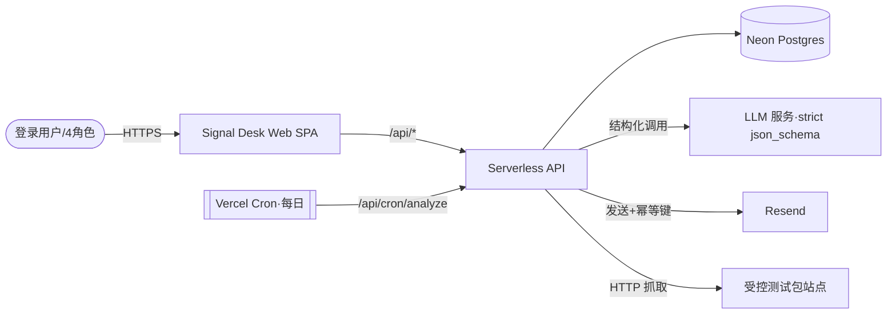

目的：把 R1 需求（solution/prd/prototype）与 D1 调研（research.md）的决策，固化为可评审、可作为 implementation 权威输入的 RFC。未知统一进入第 6 节风险与验证清单；不写实现步骤/任务拆分/DDL 细节。

## 0. 基本信息

- 需求标识（分支 / ID）：`001-competitor-intel-monitor`
- 标题：竞品情报监控代理 MVP（Signal Desk）技术设计
- 作者：DEV（设计）/ PM（用户本人，评审）
- 评审人：待补
- 状态：draft
- 最后更新：2026-07-08
- 关联链接：`requirements/solution.md`、`requirements/prd.md`、`requirements/prototype.md`、`design/research.md`；ADR 基线 `.aisdlc/project/adr/index.md`

## 1. 结论摘要（3–7 行）

- 一句话目标：为跨境卖家提供 Web 版竞品情报监控代理 MVP，把「网页变化」自动解读成「变化→战略意图→分角色行动建议」的结构化情报，并支持因人而异分发 + 引用式深度对话。
- In / Out 边界：对齐 `solution.md` §1/§8——In=带角色+权重的最简登录/Onboarding、监控目标管理、每日定时 Cron 自动采集(UR-3)、采集层「markdown 抓取 + JS 注入降级」能力（本期默认输入=测试包）、变化检测、AI 打标+真实大模型分析、个性化 Inbox（含状态）、引用式多轮对话、邮件主动通知(UR-6)、反馈；Out=真实全站规模化爬取与反爬对抗（能力已设计，真实抓取可行性见 R-010）、政策源、竞品自动推荐(UR-2)、Slack/IM、多租户权限、质量看板、跨历史追问。
- 推荐方案（机制概述）：**Vite SPA（Vercel CDN）+ Vercel Serverless Functions（`/api/*`）+ Neon Serverless Postgres**；采集层按「真实站点 markdown 抓取 + JS 注入降级（markdown<3 行触发）」设计（本期默认输入为测试包），抓取存 DB 快照，两层去噪后由 LLM（Structured Outputs 强 schema）打标+分析，按用户画像个性化排序；每日定时 Cron 自动跑全链路，Resend 邮件去重推送。
- 关键取舍：3 天 MVP 优先复用已验证 Demo（Vite）而非迁移 Next.js；采集口径收敛为「每日定时 + 手动即时触发」（不承诺分钟级实时，见 ADR-0005）。
- 优先验证点：R-003（LLM 成本/密钥）、R-007（打标与个性化匹配可用性）、R-004（去噪命中率）、R-001（Neon 重启不丢数据）。

## 2. 范围与边界

- 系统边界：单账号 MVP 的 Web 应用（前端 SPA + Serverless API + 托管 DB）；外部依赖 LLM 服务、Resend 邮件服务、受控测试包站点。不含真实竞品站点爬取、多租户、消息中间件。
- 影响面：全新系统（greenfield），无既有线上依赖需兼容；运维面为 Vercel 项目（函数、Cron、环境变量、Marketplace DB 集成）。
- 明确不做（Out）：见 §1 与 `solution.md`；特别地——不做真实全站规模化爬取与反爬对抗（采集层已设计 markdown+JS 注入能力，本期默认输入=测试包，真实抓取可行性见 R-010）、不做分钟级实时采集、不做 Slack/IM、不做权限矩阵与数据隔离。
- 不变量（不可违背，来自 `solution.md#7.2` / `prd.md#5`）：
  1. AI 输出必须可溯源到原文，禁止臆造；每条情报带原文锚点。
  2. 采集层支持真实站点 markdown 抓取 + JS 注入降级（markdown<3 行触发）；本期默认输入为测试包，真实抓取可行性以 R-010 验证。
  3. 存储必须 Serverless 友好，禁止依赖本地文件持久化（重新部署不丢数据）。
  4. 个性化「有重点、有取舍但不屏蔽」：低权重领域降权保留，不制造信息茧房。
  5. 深度对话仅基于「当前情报 + 被引用原文 + 会话上下文」，无依据答「资料不足」，不联网现抓。
  6. 未登录不得访问业务页/接口。

## 3. 推荐方案（按 C4 L1–L3）

### 3.1 C4-L1：System Context（系统上下文）

- 用户/角色：登录用户（产品经理 / 市场营销负责人 / 创业者·创始人 / 投资人 / 自定义角色）。
- 外部系统：LLM 服务（OpenAI 兼容、支持 strict json_schema）、Resend（邮件发送）、Neon（托管 Postgres）、Vercel 平台（Functions/Cron/CDN/环境变量）、受控测试包站点（`ceshi/` 基准 + 变体）。
- 系统边界：Signal Desk = 前端 SPA + Serverless API + DB；对外只通过 HTTPS 与上述外部系统交互。
- 关键交互与输入输出：用户经浏览器操作 → API 读写 DB / 调 LLM / 发邮件；Cron 定时驱动采集分析；采集从测试包 URL 拉 HTML。
- 关键约束与不变量：见 §2 不变量。

### 3.2 C4-L2：Container（容器/部署单元）

| 容器 | 职责 | 技术选型 | 对外契约入口 |
|---|---|---|---|
| Web SPA | 页面与交互（登录/Onboarding/监控目标/Inbox 双栏/设置） | Vite 8 + React 19 + react-router 7（静态构建，Vercel CDN） | 复用 Demo 组件；调用 `/api/*` |
| Serverless API | 业务逻辑与外部集成 | Vercel Functions（Node.js，`/api/*`） | REST（见 §3.5） |
| Cron Job | 每日无人工自动采集分析 | Vercel Cron（`vercel.json` crons）→ `/api/cron/analyze`（`CRON_SECRET` 保护） | 内部触发 |
| 数据库 | 持久化用户/画像/目标/快照/情报/对话/反馈/通知去重 | Neon Serverless Postgres（`@neondatabase/serverless`） | SQL（组件内部） |
| LLM（外部） | 打标 + 五要素分析 + 对话 | OpenAI 兼容 API，Structured Outputs | HTTPS |
| Resend（外部） | 邮件主动通知 | Resend Node SDK | HTTPS + idempotency key |
| 测试包站点 | 采集输入（基准/变体页面） | 静态 HTML（随部署或独立 URL） | HTTP GET |

- 关键数据流：`采集(fetch)→存快照(DB)→两层去噪 diff→LLM 打标+分析(结构化)→写情报(DB)→按画像匹配排序→Inbox/邮件`。

### 3.3 C4-L3：Component（组件）

API 内部组件（职责 / 关键接口 / 依赖）：

- **Auth**：注册/登录/登出；密码哈希（bcrypt/scrypt），签发 httpOnly+Secure Cookie JWT；中间件校验会话。依赖 DB。
- **Profile**：读写用户画像（角色 + 六标签权重向量 + 通知偏好）；角色默认权重来自内置表（复用 Demo `ROLE_DEFAULT_WEIGHTS`）；支持自定义角色。依赖 DB。
- **Targets**：竞品 CRUD（名称/URL/赛道/采集方式：`manual`|`scheduled`+schedule）。依赖 DB。
- **Collector**：按 URL 抓取 → 提取正文为 markdown（markdown<3 行触发 JS 注入/渲染降级再抓）→ 抽取可见文本 → 存快照；对比对象为库中上一快照。本期默认输入为测试包 HTML，真实站点抓取可行性见 R-010。依赖 DB + 采集目标站点（本期测试包）。
- **ChangeDetector（去噪第 1 层）**：抽取可见文本（剥离 style/script/注释/属性）→ 空白归一化 → 区块/行 diff → 输出「变化候选」；天然过滤纯 CSS 噪音。
- **AIAnalyzer（去噪第 2 层）**：对候选调用 LLM（strict json_schema + Zod 校验）产出 `labels[]/priority/whatChanged/whyItMatters/actionGeneral/actionPlan/sourceAnchor/isNoise/noiseType`；`isNoise=true`（A/B 摇摆、幻觉诱饵、未上线）不生成情报。处理 refusal/截断→标记分析失败可重试。依赖 LLM。
- **Matcher**：按用户角色 + 权重对情报打分排序（复用 Demo 打分：Σ标签权重 + 优先级加成），低权重降权保留不隐藏。
- **Insights**：情报列表（晨报/核心池/全部 + 筛选 + 角色快切）、详情、状态（未读/已读/归档）、核心池标记。依赖 DB。
- **Chat**：引用式多轮对话；grounded prompt 限定「当前情报 + 被引用原文 + 会话上下文」；多会话管理，历史持续落盘至终止。依赖 LLM + DB。
- **Feedback**：情报打标（标签 + 问题模块 + 补充说明）；「有用」自动入核心池。依赖 DB。
- **Notifier**：对「紧急/高匹配」情报经 Resend 发送，`用户+情报ID` 作 idempotency key 去重；失败不阻塞情报入库。依赖 Resend + DB。

关键数据模型（到组件层级；字段基线沿用 Demo `mockData.ts`，DDL 细节留 implementation）：
`User、Profile(role+weights+customRoles)、Target、Snapshot(targetId+version+html+capturedAt)、Intel(labels/priority/五要素/status/matchScore/inCorePool/feedback)、ChatSession+ConvMsg、Notification(去重键)`。

状态机 / 幂等一致性：
- Intel 状态：`未读 → 已读 → 归档`（归档默认隐藏，可筛选找回；持久化）。
- 分析任务：`pending → success | failed(可重试)`；不产出半成品情报（异常-2/异常-8）。
- Chat 会话：`active → ended`（终止后落盘，不可继续，可新开）。
- 幂等：同目标同快照不重复生成情报；邮件 idempotency key（24h）；Cron 防重叠（单次处理到期目标 + 运行锁 + `maxDuration` ≤300s，目标多时分片）。

### 3.4 关键决策与取舍（对应 ADR）

| # | 决策点 | 选择 | 取舍理由（为什么选它） | 若不满足前提的降级/替代 |
|---|---|---|---|---|
| ADR-0001 | 托管数据库 | Neon Serverless Postgres + `@neondatabase/serverless` | Vercel Postgres 已停用迁 Neon；Serverless 友好、Marketplace 一键接入，满足重启不丢数据 | Supabase/Prisma Postgres（Marketplace 同类） |
| ADR-0002 | 部署形态/前端栈 | Vite SPA + Vercel Serverless Functions（`/api/*`） | 3 天内复用已验证 Demo，避免迁移返工 | 迁移 Next.js（后续演进） |
| ADR-0003 | LLM 结构化输出 | Structured Outputs（`strict:true` json_schema）+ Zod | 100% schema 合规，杜绝字段缺失/幻觉枚举，支撑打标与五要素 | legacy JSON mode + 校验重试；关键词规则打标兜底 |
| ADR-0004 | 变化检测去噪 | 两层过滤（结构层文本 diff + 语义层 LLM 判噪） | 样式噪音交确定的文本 diff，A/B与幻觉交 LLM，最大化 Recall 抑制 FP | 强化正文抽取/归一化预处理 + few-shot |
| ADR-0005 | 采集口径 | 每日定时 Cron 自动采集 + 手动即时触发（不承诺实时） | Hobby Cron 仅每日一次；收敛为确定形态，免付费/返工 | 上 Pro 拿分钟级 / 外部调度器（演进） |
| ADR-0006 | 认证会话 | httpOnly+Secure Cookie 承载签名 JWT + 密码哈希 | 无状态最贴合 Serverless，实现最快，满足最低安全底线 | DB session 表 / Supabase Auth |
| ADR-0007 | 邮件通知 | Resend + idempotency key 去重 | 免费额度够用，内置幂等键天然满足「同情报只推一次」 | SMTP+Nodemailer / 站内红点保底 |
| ADR-0008 | 采集机制 | 真实站点 markdown 抓取 + JS 注入降级（<3 行触发）+ DB 存快照；本期默认输入=测试包 | 忠于原始《生成MD测试用例》能力；本期测试包默认输入规避真实站点不确定性，链路一次成型 | 仅静态 fetch + 测试包默认（R-010 不成立时） |

### 3.5 对外承诺要点（要点 + 追溯，不写字段/DDL）

- API（Serverless，REST）契约要点（对齐 `prd.md#9` / `prototype.md#3`）：
  - `POST /api/auth/register`、`POST /api/auth/login`、`POST /api/auth/logout`
  - `GET/PUT /api/profile`（角色+权重+通知偏好+自定义角色）
  - `GET/POST /api/targets`、`PUT/DELETE /api/targets/:id`
  - `POST /api/analyze`（手动即时触发）、`GET /api/cron/analyze`（每日定时，`CRON_SECRET` 保护）
  - `GET /api/insights`（按画像个性化排序）、`GET /api/insights/:id`、`PATCH /api/insights/:id`（已读/归档/核心池）
  - `POST /api/insights/:id/chat`（引用式多轮）、`POST /api/insights/:id/feedback`
  - `POST /api/notify`（Resend 推送，供 Cron/分析后调用）
- 权限：仅「已登录」门槛；`/api/cron/*` 用 `CRON_SECRET` 保护。无细粒度权限。
- 数据口径：优先级三档（紧急>中等>低）；六大信息标签固定枚举；情报须命中 ≥1 标签。
- 兼容性：`/inbox/:id`→`?id=:id&view=detail`、`/chat`→`?view=chat` 兼容重定向。
- 迁移与回滚：greenfield 无数据迁移；回滚=重新部署（数据在 Neon 持久，不随部署丢失）。
- 契约 SSOT 说明：项目暂无 `project/contracts/` 与 `project/components/` 目录（见 §4 CONTEXT GAP）；本期契约以本 RFC §3.5 + Demo 类型（`demo/.../mockData.ts`）为基线，implementation 阶段落 DDL/字段。

## 4. 与现有系统的对齐（基于 `requirements/solution.md#impact-analysis`）

> **CONTEXT GAP（重要）**：项目级知识库全部缺失，经核验 `.aisdlc/project/**` 为空——
> - `CONTEXT GAP`：`.aisdlc/project/memory/{product,glossary}.md` 缺失
> - `CONTEXT GAP`：`.aisdlc/project/components/index.md` 及各模块组件页缺失（无既有 `#api-contract`/`#data-contract` 可引用）
> - `CONTEXT GAP`：`.aisdlc/project/adr/index.md` 缺失（本 RFC 同批新建 ADR 基线）
>
> 判定：项目为 **greenfield**（对应 `solution.md` V-005 / `prd.md` R-005，待 PM 在评审时确认）。因不存在既有线上模块与契约，`solution.md#7.1` 列出的所有模块均为**新增基线**，不存在破坏性兼容问题；但按 D2-DoD 规则，本节「与现有系统的对齐」**不勾选为已完成**，而是记为「greenfield 新增基线 + 待 V-005 确认」，缓解路径见第 6 节 R-005。

### 4.1 契约兼容性声明（逐模块）

对 `solution.md#7.1` 的受影响模块（Auth / 用户画像 / 监控目标 / 采集调度 / 变化检测 / AI 打标 / AI 分析 / 个性化 Inbox / 主动通知 / 引用式对话 / 反馈）：

- 兼容性结论：**全部为新增能力（新增基线）**，无既有契约需兼容；契约要点见 §3.5，字段基线见 Demo `mockData.ts`。
- 缓解：implementation 阶段应同步创建 `project/components/{module}.md` 与 `#api-contract`/`#data-contract`，把本 RFC 要点沉淀为 SSOT（见 R-005 动作）。

### 4.2 ADR 合规声明（逐 ADR）

- 既有 ADR：无（索引缺失）。
- 本 RFC 新增 ADR-0001~0008（见 `.aisdlc/project/adr/`），覆盖 DB/部署/LLM/去噪/采集口径/认证/邮件/采集机制八项关键决策；均标记 `Accepted`（待评审）。

### 4.3 状态机 / 领域事件影响

- 新增状态机：Intel 状态（未读/已读/归档）、分析任务状态（pending/success/failed）、Chat 会话（active/ended），详见 §3.3。
- 无既有状态机被改变（greenfield）。

### 4.4 跨模块影响确认（基于 `solution.md#7.3`）

- 用户画像 → 匹配/Inbox：画像是个性化打分排序输入，变更即时生效（规则-10）。
- 变化检测 → 打标/分析：检测结果是打标与分析的唯一「变化事实」来源。
- 打标/分析 → Inbox/对话：信息标签、优先级、原文锚点由此产出。
- 认证 → 全站：会话是访问前提，MVP 不做数据隔离。

## 5. 影响分析

- 上下游系统影响：无既有系统；新增对 LLM/Resend/Neon 三个外部服务的依赖（密钥经环境变量注入）。
- 数据口径影响：新增六标签/三优先级/角色权重口径（枚举固定）。
- 运行与运维：Vercel 项目需配置 `crons`、`CRON_SECRET`、`DATABASE_URL`、`RESEND_API_KEY`、LLM 密钥、`SESSION_SECRET`；Cron 单函数 ≤300s，目标多时分片；分析失败/邮件失败均记状态可重试。
- 迁移/回滚：greenfield 无迁移；回滚以重新部署为主，数据在 Neon 持久不受影响。

## 6. 风险与验证清单（所有不确定性仅在此处）

| # | 风险/假设 | 验证方式 | 成功信号 | 失败信号 | Owner | 截止 | 下一步动作 |
|---|---|---|---|---|---|---|---|
| R-001 | Neon 重启后数据仍在 | 接入 Neon 跑「注册+存情报+重新部署」 | 数据仍在 | 数据丢失 | DEV | 开发启动后 0.5 天 | 换 Supabase/Prisma Postgres，更新数据访问层 |
| R-002 | 3 天工时覆盖全部 MVP | 开工半天工时切分，引用式深度对话列最后可裁剪 | 核心闭环 Day2 前可演示 | 超期 | DEV+PM | 开发启动当天 | 深度对话降级单轮追问，先保核心闭环 |
| R-003 | LLM 结构化调用成本/密钥可用 | 单条「打标+五要素」端到端 Structured Outputs 调用记录耗时/token | 稳定返回且成本可接受 | 不稳定/超预算 | PM 供密钥/DEV | 开发启动后 0.5 天 | 打标降级关键词规则+AI 辅助；低优先级只出通用建议或换低成本模型 |
| R-004 | 两层去噪命中率 | 全量跑 `ceshi/cases/` 正/反向用例统计 Recall/FP | 样式/A-B/幻觉不报、真信号全捕获 | 误报或漏报 | DEV | Day2 结束前 | 强化正文抽取/归一化 + 语义层 few-shot |
| R-005 | greenfield 确认 + 模块/ADR 基线采纳 | PM 评审确认无既有知识库 | 确认 greenfield 且采纳基线 | 非 greenfield | PM | 方案评审时 | 非 greenfield 则先 project-discover 补权威入口再复核对齐 |
| R-006 | AI 幻觉基线 | 抽查逐字核对 What Changed 与原文；构造无依据追问验兜底 | 无编造、资料不足能坦白 | 出现编造 | PM 验收/DEV | MVP 演示前 | 强化「仅基于原文+强制锚点」提示 |
| R-007 | 打标与个性化匹配可用性（核心） | `ceshi/cases/` 覆盖 6 标签×4 角色核对打标与个性化排序 | 标签命中正确、切画像排序有差异且重点置顶 | 打标乱/排序无差异 | PM 验收/DEV | Day2 结束前 | 个性化降级「筛选+高亮」而非重排 |
| R-008 | Resend 邮件可用性 | 验证域名或用 `onboarding@resend.dev` 触发真实发送 + 二次触发验去重 | 稳定发出且收到、去重生效 | 发不出/重复 | PM 供密钥/DEV | 开发启动后 1 天 | 降级站内通知/红点，邮件转后续 |
| R-010 | 真实站点 markdown 抓取 + JS 注入降级（<3 行触发）在 Vercel Serverless 可行 | 选 1–2 个真实站点（含需 JS 注入的 klingai/ihuiwa 类）走 `fetch→markdown→(不足则注入)` 链路，记录耗时/成功率 | 跑通且不超时 | 超时/无头渲染跑不起来 | DEV | Day2 结束前 | 降级「仅静态 fetch + 测试包默认输入」，真实 JS 注入抓取转后续演进 |

## 7. 追溯链接

- `requirements/solution.md`（#2 推荐方案 / #2.1 三大亮点 / #7 Impact Analysis / #5 验证清单）
- `requirements/prd.md`（#5 规则 / #6 AC / #8 验证清单 / #9 影响面）
- `requirements/prototype.md`（页面/接口/走查脚本）
- `design/research.md`（T1–T9 决策与证据）
- 项目知识库（缺失，见 §4 CONTEXT GAP）：`project/memory/*`、`project/components/index.md`、`project/adr/index.md`
- 新建 ADR：`.aisdlc/project/adr/index.md` 与 ADR-0001~0008
- Demo 基线：`demo/src/prototypes/001-competitor-intel-monitor/`（类型与状态机基线）

## 8. 迭代记录（追加，不覆盖）

- 2026-07-08：D2 首版落盘。基于 research.md 的八项决策，产出 C4 L1–L3、决策表与 ADR 基线；因项目知识库缺失标注 CONTEXT GAP 并按 greenfield 处理（待 R-005 确认）；采集口径按 ADR-0005 固化为「每日定时 Cron + 手动即时触发」。
- 2026-07-08：原始需求对齐复核。按用户裁决把采集机制（ADR-0008）对齐原始《生成MD测试用例》——采集层「真实站点 markdown 抓取 + JS 注入降级（<3 行触发）」入案，本期默认输入=测试包，真实抓取可行性新增验证项 R-010；C 类（Visualping/Perplexity 对标、噪音率、漏抓/A-B 误报反馈标签）同步进 prd/prototype/demo。
