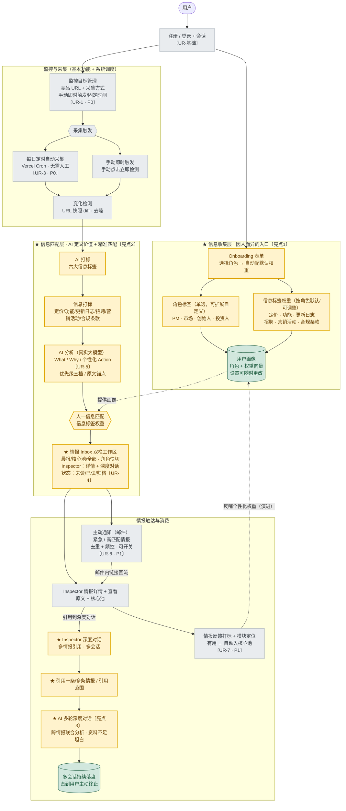

> 基于收敛后的 `prd.md`（三大核心亮点 + UR-1~UR-7 优先级：P0 必做 / P1 也做 / P2 本期不做）绘制。
> 标记说明：★ = 三大核心亮点节点（黄色高亮）；〔UR-x〕= 对应用户需求；灰色 = 基本功能/系统；绿色 = 落盘存储。

## 1. 端到端产品链路（收敛版）

## 2. 链路分段说明

| 阶段 | 环节 | 优先级 | 对应需求 |
|---|---|---|---|
| 入口 | 注册/登录 → ★Onboarding 画像（角色+信息标签权重） | P0 | 亮点1 |
| 监控 | 监控目标管理（竞品+赛道+绑定测试包） | P0 | UR-1 |
| 采集 | 每日定时自动采集(Cron) + 手动即时触发 → 变化检测去噪 | P0 | UR-3 |
| 匹配 | ★AI 价值定义与打标 → AI 分析(个性化 Action) → 人-信息匹配 → ★个性化 Inbox(含归档) | P0 | 亮点2 / UR-4 / UR-5 |
| 触达 | 主动通知（邮件推送重点/紧急情报） | P1 | UR-6 |
| 消费 | Inspector 详情溯源 → ★引用式多轮深度对话（Inspector 内嵌，多情报/多会话） | P1 | 亮点3 |
| 聚焦 | 核心信息池视图（手动/反馈「有用」自动加入） | P1 | UR-7 延伸 |
| 改进 | 情报反馈打标落库（权重反哺属演进） | P1 | UR-7 |

## 3. 三大核心亮点一句话定位

| 层 | 亮点 | 一句话 |
|---|---|---|
| ★ 信息收集层 | 角色标签 + 信息标签权重 | 注册即建画像——「我是谁、我更关注什么」，有重点有取舍地为不同产品/岗位定制信息入口。 |
| ★ 信息匹配层 | AI 打标 + 信息标签匹配 | AI 按六大信息标签识别网页变化，再按角色与权重把最相关的情报重点推给对的人。 |
| ★ 信息消费层 | 引用式深度对话 | 在 Inbox Inspector 内引用一条或多条情报多轮深挖，支持多会话与跨情报联合分析，二次萃取价值。 |

## 4. 边界说明

- P2 不在链路内：UR-2「竞品自动推荐（自动发现监控目标）」列为后续演进。
- 「其它领域降权保留不屏蔽」体现「有重点、有取舍但不制造信息茧房」（`prd.md` 规则-9）。
- 画像变更即时生效于匹配层排序（规则-10）；打标/分析/对话均**仅基于原文**作答，禁止臆造（规则-3/4）。
- 系统级节点无独立页面：`/api/cron/analyze`（UR-3 定时）、`/api/notify`（UR-6 邮件）。
