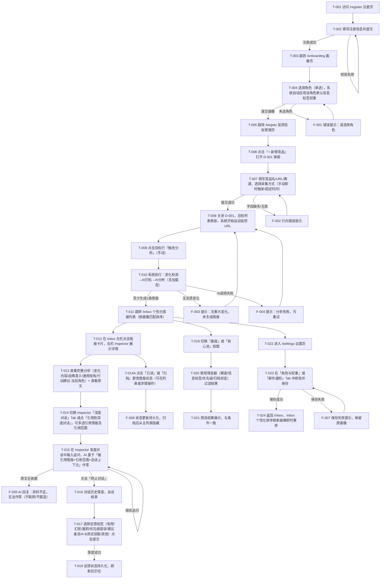

> 目的：把 `requirements/prd.md` 的核心场景/规则/AC，转写为可走查、可评审、可验证的交互说明，消除实现与验收歧义（不做视觉稿）。
>
> 规则：结论优先；只写会影响实现/验收的最小信息；本文档中不出现"待确认问题"清单——所有不确定性统一引用 PRD 第 8 节或 solution.md 的验证清单（Owner/截止/动作明确）。

## 0. 基本信息

- 需求标识（分支 / ID）：`001-competitor-intel-monitor`
- 作者 / 参与评审：产品经理（用户本人）/ 待补
- 状态：draft
- 最后更新：2026-07-08（Demo 反写修订：双栏 Inbox 工作区、核心信息池、Onboarding 角色自动配权重、设置两 Tab、多情报引用对话、会话管理）
- Demo 参考：`demo/src/prototypes/001-competitor-intel-monitor/`（产品名 **Signal Desk**）
- Figma 链接入口：无

---

## 1. 场景清单（与 PRD 对齐）

| 场景编号 | 场景标题（用户视角） | 成功标准（1–3 条） | 任务流节点（T-xxx…） | 页面链路摘要（P-xxx → …） | PRD 对应 AC |
|---|---|---|---|---|---|
| S-001 | 设定角色画像、建立监控并首次获得个性化情报 | ①Onboarding 选角色并自动配权重；②登记/编辑竞品；③触发分析后 Inbox 出现按画像匹配的情报 | T-001→T-011 | P-001/P-002 → P-003 → P-004 → D-001 → P-004 → P-005 | AC-001~AC-005 |
| S-002 | 引用式深度对话并对情报打标反馈 | ①Inspector 详情展示完整分析+查看原文；②Inspector 深度对话支持多情报引用与多会话；③反馈含模块定位并持久化 | T-012→T-018 | P-005（Inspector 详情/对话 Tab） | AC-006~AC-009 |
| S-003 | 调整画像、快速消费当日重点情报 | ①晨报/核心池视图；②筛选准确；③设置页保存角色权重或邮件通知后 Inbox 排序变化 | T-019→T-024 | P-005 ↔ P-007 | AC-010~AC-012 |

---

## 2. 端到端任务流

> 编号约定：任务流节点 T-001…；页面 P-001…；弹窗 D-001…；抽屉 W-001…；反馈/提示 F-001…



---

## 3. 页面/弹窗清单

| Node ID | 类型 | 名称/目的 | 入口（从哪里来） | 覆盖任务流节点（T-xxx…） | 覆盖场景 | 备注 |
|---|---|---|---|---|---|---|
| P-001 | P | 登录页 `/login` | 直接访问；未登录业务页重定向 | T-001（已有账号路径） | S-001/S-002/S-003 | 未登录必须先经过本页 |
| P-002 | P | 注册页 `/register` | 登录页「去注册」链接；首次访问 | T-001~T-002 | S-001 | 注册成功跳 P-003 |
| P-003 | P | Onboarding 用户画像页 `/onboarding` | 注册成功后自动跳转；画像缺失时引导 | T-003~T-004 | S-001 | 仅新用户/画像缺失用户；完成后跳 P-004 |
| P-004 | P | 监控目标管理页 `/targets` | Onboarding 完成后；左侧导航 | T-005~T-010 | S-001 | 竞品增删改查；采集方式；立即检测 |
| D-001 | D | 新增/编辑竞品弹窗 | P-004「新增竞品」或行内「编辑」 | T-006~T-008 | S-001 | 同一弹窗复用：新增与编辑 |
| P-005 | P | 情报 Inbox 工作区 `/inbox` | 登录后默认页；左侧导航 | T-011~T-024 | S-001/S-002/S-003 | **双栏工作区**：左栏情报列表 + 右栏 Inspector（详情/深度对话 Tab）；含晨报/核心池/全部视图、筛选、角色快切 |
| P-006 | P | 情报详情（P-005 右栏 Inspector·详情 Tab） | P-005 左栏卡片点击 | T-012~T-013/T-017~T-018 | S-002 | 中文标签分析区 + 查看原文 + 核心池 + 反馈打标；`/inbox/:id` 兼容重定向至此 |
| P-008 | P | 深度对话（P-005 右栏 Inspector·对话 Tab） | P-005 Inspector Tab 切换；「引用到深度对话」 | T-014~T-016 | S-002 | 多情报引用、多会话管理、引用范围；`/chat` 兼容重定向至此 |
| P-007 | P | 设置页 `/settings` | 左侧导航；Inbox 角色快切「管理角色」 | T-022~T-024 | S-003 | 两个 Tab：**角色与权重**（含自定义角色）/ **邮件通知**（多邮箱） |

---

## 4. 页面说明（逐页）

---

### 4.1 P-001 登录页

#### 4.1.1 入口与目的

- **ID**：P-001
- **页面目的**：已注册用户通过邮箱+密码登录，取得会话。
- **入口**：直接访问 `/login`；未登录用户访问任何业务页面时，由系统重定向至此（对应规则-6、异常-1）。
- **前置条件**：无（无需登录）。
- **涉及场景**：S-001/S-002/S-003（所有场景入口之一）

#### 4.1.2 ASCII 线框

```text
P-001 登录页
+----------------------------------------------------+
|              竞品情报监控代理                       |
+----------------------------------------------------+
|                                                    |
|   邮箱:    [____________________________________]  |
|            < 邮箱格式错误时显示行内红色提示 >        |
|                                                    |
|   密码:    [____________________________________]  |
|                                                    |
|   [              登  录              ]             |
|   < 账号/密码错误：页面顶部 banner 提示 >            |
|                                                    |
|   还没有账号？ [立即注册]                           |
|                                                    |
+----------------------------------------------------+
```

#### 4.1.3 关键状态与反馈

| 状态 | 触发条件 | 界面要点 | 恢复路径 |
|---|---|---|---|
| 正常 | 页面加载完成 | 邮箱+密码输入框可用，登录按钮可点击 | — |
| 加载中 | 点击登录按钮，等待接口响应 | 登录按钮显示 Loading/禁用，防重复提交 | 自动（接口返回后恢复） |
| 账号/密码错误 | 接口返回 401 | 页面顶部 banner 提示"邮箱或密码错误，请重试" | 用户修改后重新提交 |
| 邮箱格式错误 | 客户端校验失败 | 邮箱字段下方行内红色提示 | 修正后清除提示 |
| 无权限（未登录重定向） | 未登录访问业务页 | 跳转至登录页，登录成功后返回原页面（或 Inbox） | 登录成功自动跳转 |
| 服务端错误 | 接口返回 5xx | 页面顶部 banner 提示"服务暂时不可用，请稍后重试" | 用户手动重试 |

#### 4.1.4 关键校验与错误处理

- 校验-1：邮箱字段不为空且格式符合 `x@x.x`，否则行内提示"请输入有效邮箱"。
- 校验-2：密码字段不为空，否则行内提示"请输入密码"。
- 校验-3：登录期间按钮禁用，防止重复提交。

#### 4.1.5 跳转与交互

- **成功后**：跳转至 `/inbox`（或登录前被重定向前的原目标页）。若用户无 Onboarding 画像，跳转至 `/onboarding`。
- **失败后**：留在当前页，展示错误提示，保留已填邮箱、清空密码。
- **取消/关闭**：无。
- **返回**：无（登录页为起点）。

---

### 4.2 P-002 注册页

#### 4.2.1 入口与目的

- **ID**：P-002
- **页面目的**：新用户创建账号。
- **入口**：P-001「立即注册」链接；直接访问 `/register`。
- **前置条件**：无（无需登录）。
- **涉及场景**：S-001

#### 4.2.2 ASCII 线框

```text
P-002 注册页
+----------------------------------------------------+
|              创建账号                               |
+----------------------------------------------------+
|                                                    |
|   邮箱:      [________________________________]   |
|              < 邮箱已注册时：行内提示 >             |
|                                                    |
|   密码:      [________________________________]   |
|              < 密码强度提示（如弱/中/强）>           |
|                                                    |
|   确认密码:  [________________________________]   |
|              < 两次不一致时：行内提示 >             |
|                                                    |
|   [              注  册              ]             |
|   < 注册失败时顶部 banner 提示 >                   |
|                                                    |
|   已有账号？ [去登录]                              |
|                                                    |
+----------------------------------------------------+
```

#### 4.2.3 关键状态与反馈

| 状态 | 触发条件 | 界面要点 | 恢复路径 |
|---|---|---|---|
| 正常 | 页面加载完成 | 三个输入框可用 | — |
| 加载中 | 点击注册，等待接口 | 注册按钮 Loading/禁用 | 自动 |
| 邮箱已注册 | 接口返回 409 | 邮箱字段行内提示"该邮箱已注册，请直接登录" | 用户修改邮箱或跳去登录 |
| 密码不一致 | 客户端校验失败 | 确认密码字段行内提示"两次密码不一致" | 修正后重试 |
| 注册成功 | 接口 200 | 无额外提示，直接跳转 P-003 Onboarding | 自动跳转 |
| 服务端错误 | 接口返回 5xx | 顶部 banner 提示"注册失败，请稍后重试" | 手动重试，保留输入 |

#### 4.2.4 关键校验与错误处理

- 校验-1：邮箱格式校验（客户端）。
- 校验-2：密码最短长度（建议 ≥ 6 位，接受具体业务决定，不确定项引用 R-005）。
- 校验-3：确认密码与密码字段一致（客户端）。
- 校验-4：三字段均不为空。

#### 4.2.5 跳转与交互

- **成功后**：跳转至 P-003 Onboarding 用户画像页。
- **失败后**：留当前页，保留邮箱字段，清空密码。
- **取消/关闭**：点击「去登录」回 P-001。
- **返回**：浏览器返回→回 P-001。

---

### 4.3 P-003 Onboarding 用户画像页

#### 4.3.1 入口与目的

- **ID**：P-003
- **页面目的**：收集用户角色标签（单选），系统按角色默认权重自动建立用户画像。对应〔亮点1·信息收集层〕与规则-7、规则-8、AC-001。
- **入口**：注册成功后自动跳转；登录后若画像缺失，系统引导跳转（对应异常-6）。
- **前置条件**：用户已完成注册且已登录；画像尚未提交（已有画像则跳转 P-005）。
- **涉及场景**：S-001

#### 4.3.2 ASCII 线框

```text
P-003 Onboarding — 角色选择
+--------------------------------------------------------------+
|  第一步：告诉我们你的角色                                       |
|  系统将根据角色自动配置信息权重，进入 Inbox 后可微调             |
+--------------------------------------------------------------+
|                                                              |
|  我的角色（单选，必填）                                        |
|  +----------------------------------------------------------+ |
|  | (o) 产品经理                                             | |
|  | ( ) 市场营销负责人                                        | |
|  | ( ) 创业者·创始人                                         | |
|  | ( ) 投资人                                               | |
|  +----------------------------------------------------------+ |
|  < 未选择时：提交后行内提示"请选择角色" >                      |
|                                                              |
|  将为你配置以下信息权重（预览，只读）                            |
|  +----------------------------------------------------------+ |
|  | [定价·3] [功能·5] [更新日志·4] [招聘·2] [营销·3] [合规·2]  | |
|  +----------------------------------------------------------+ |
|                                                              |
|  [              开始监控竞品（进入下一步）              ]       |
|                                                              |
+--------------------------------------------------------------+
```

#### 4.3.3 关键状态与反馈

| 状态 | 触发条件 | 界面要点 | 恢复路径 |
|---|---|---|---|
| 正常 | 页面加载完成 | 角色全部未选中；选中角色后展示默认权重预览 | — |
| 提交加载中 | 点击下一步，等待接口 | 按钮 Loading/禁用 | 自动 |
| 校验失败 | 角色未选 | 对应区块下方行内提示，按钮恢复可用 | 修正后重新提交 |
| 提交成功 | 接口 200，画像落库 | 直接跳转 P-004 | 自动 |
| 服务端错误 | 接口 5xx | 顶部 banner 提示"保存失败，请稍后重试"，保留输入 | 手动重试 |

#### 4.3.4 关键校验与错误处理

- 校验-1：角色必选一项（对应规则-7）。
- 校验-2：提交时自动应用该角色的默认信息标签权重（见 `solution.md#亮点-2` 默认偏好表）；用户无需在 Onboarding 手动调权重。

#### 4.3.5 跳转与交互

- **成功后**：跳转至 P-004 监控目标管理页。
- **失败后**：留当前页，保留已选内容，展示提示。
- **取消/关闭**：MVP 不设跳过（必须完成 Onboarding 才能进入业务页）。
- **返回**：不设返回（Onboarding 流程中的唯一步骤）。

---

### 4.4 P-004 监控目标管理页

#### 4.4.1 入口与目的

- **ID**：P-004
- **页面目的**：管理竞品监控目标（增/删/查），提供竞品 URL 由系统自动识别变化并监控（采集层：markdown 提取 + JS 注入降级 <3 行触发，本期默认测试包输入，真实抓取见 R-010）；支持「手动即时触发」与「固定时间采集（每日定时）」两种模式；每日定时 Cron 自动采集见规则-11/AC-013。
- **入口**：Onboarding 完成后跳转；左侧导航「监控目标」入口；已登录用户可直接访问 `/targets`。
- **前置条件**：已登录 + 已完成 Onboarding（否则重定向至 P-003）。对应规则-6、异常-6。
- **涉及场景**：S-001

#### 4.4.2 ASCII 线框

```text
P-004 监控目标管理页  /targets
+-------------------------------------------------------------------+
|  监控目标                              [+ 新增竞品]               |
+-------------------------------------------------------------------+
|  空状态（无任何目标时）：                                          |
|  +---------------------------------------------------------------+ |
|  |  暂无监控目标                                                 | |
|  |  点击右上角「+ 新增竞品」开始监控第一个竞品                    | |
|  +---------------------------------------------------------------+ |
|                                                                   |
|  有数据时：                                                        |
|  竞品名称      | URL             | 赛道   | 采集方式     | 状态   | 操作              |
|  -------------|-----------------|--------|--------------|--------|-------------------|
|  Midjourney   | https://mj.run  | 生图   | 固定时间 09:00| 监控中 | 立即检测 编辑 删除|
|  Runway ML    | https://run.ai  | 生视频 | 手动即时触发 | 监控中 | 立即检测 编辑 删除|
|                                                                   |
|  < 触发分析时，对应行按钮变为 Loading 状态，分析完成后提示 >        |
|  < 分析成功：toast "分析完成，情报已生成，前往 Inbox 查看" [查看]> |
|  < 无实质变化：toast "无重大变化，未生成新情报" >                   |
|  < 分析失败：toast "分析失败，请稍后重试" [重试] >                 |
|                                                                   |
+-------------------------------------------------------------------+
```

#### 4.4.3 关键状态与反馈

| 状态 | 触发条件 | 界面要点 | 恢复路径 |
|---|---|---|---|
| 空状态 | 无监控目标 | 空态提示 + 引导新增 | 点击新增 |
| 正常列表 | 有≥1条目标 | 表格展示；触发分析/删除按钮 | — |
| 分析进行中 | 点击「触发分析」 | 对应行按钮 Loading + 禁用，防重复 | 等待接口返回 |
| 分析成功 | 接口返回 & 至少生成1条情报 | toast 提示成功 + 跳转链接 | — |
| 无实质变化 | 基准≈变体或仅样式差异 | toast 提示"无重大变化"（对应规则-2/异常-3） | — |
| 分析失败/超时 | AI 调用失败（对应异常-2/异常-8） | toast 提示"分析失败，可重试" | 手动点击重试 |
| 删除确认 | 点击「删除」 | 弹窗二次确认（高风险不可逆操作，对应模板规范） | 取消 / 确认 |

#### 4.4.4 关键校验与错误处理

- 校验-1：新增竞品时 URL 合法即可，系统自动开始监控，无需用户上传页面文件。
- 校验-2：删除操作不可逆，需弹出确认（"删除后该竞品及其历史情报将移除，是否确认？"），高风险操作。

#### 4.4.5 跳转与交互

- **新增竞品**：打开 D-001 弹窗（空表单）。
- **编辑竞品**：打开 D-001 弹窗（预填当前行数据）。
- **分析成功后**：toast 提供「查看情报」链接，点击跳转 P-005。
- **删除成功后**：列表刷新，移除对应行。
- **取消/关闭**：保留当前列表，无额外操作。
- **返回**：左侧导航切换，或浏览器返回。

---

### 4.5 D-001 新增竞品弹窗

#### 4.5.1 入口与目的

- **ID**：D-001
- **页面目的**：收集新竞品信息或编辑已有竞品（名称/URL/赛道/采集方式），保存后系统自动监控该 URL 的变化。对应 AC-002。
- **入口**：P-004「新增竞品」或行内「编辑」按钮触发。
- **前置条件**：已登录、已完成 Onboarding。
- **涉及场景**：S-001

#### 4.5.2 ASCII 线框

```text
D-001 新增监控竞品（弹窗）
+----------------------------------------------+
|  新增监控竞品                           [×]  |
+----------------------------------------------+
|                                              |
|  竞品名称:  [____________________________]   |
|             < 必填，不为空 >                 |
|                                              |
|  官网 URL:  [____________________________]   |
|             < 必填，合法 URL 格式 >           |
|             系统将自动抓取并识别页面变化      |
|                                              |
|  赛道:      [ 生图          ▼ ]              |
|             （选项：生图 / 生视频 / Agent）   |
|                                              |
|  采集方式:                                   |
|  ( ) 手动即时触发 — 手动点击立即检测          |
|  (o) 固定时间采集 — 按设定时间定时抓取对比    |
|                                              |
|  每日采集时间: [ 09:00  ▼ ]  <固定时间时显示> |
|                                              |
|  [        取消        ] [    确认添加    ]    |
|                                              |
+----------------------------------------------+
```

#### 4.5.3 关键状态与反馈

| 状态 | 触发条件 | 界面要点 | 恢复路径 |
|---|---|---|---|
| 正常（空表单） | 弹窗打开 | 全空白 | — |
| 加载中 | 点击确认，等待保存 | 确认按钮 Loading/禁用 | 自动 |
| 校验失败 | 必填字段为空或 URL 非法 | 对应字段行内提示 | 修正后重试 |
| 保存成功 | 接口 200 | 弹窗关闭，P-004 列表新增一行 | — |
| 保存失败 | 接口 5xx | 弹窗内顶部 banner 提示 | 修正后重试 |

#### 4.5.4 关键校验与错误处理

- 校验-1：竞品名称不为空。
- 校验-2：URL 合法（`https?://` 开头）。
- 校验-3：赛道必选一个。
- 校验-4：采集方式必选；选「固定时间采集」时须设置采集时间。

#### 4.5.5 跳转与交互

- **成功后**：弹窗关闭，P-004 列表刷新（新增行出现）。
- **失败后**：弹窗保留，展示错误，保留已填内容。
- **取消/关闭**：点击「取消」或「×」，弹窗关闭，内容丢弃（无需二次确认，因内容未保存）。

---

### 4.6 P-005 个性化情报 Inbox

#### 4.6.1 入口与目的

- **ID**：P-005
- **页面目的**：双栏情报工作区——左栏按画像个性化排序的列表，右栏 Inspector 承载详情与深度对话。支持晨报/核心池/全部视图、筛选、角色快切、情报状态操作。对应〔亮点2落地〕、UR-4、规则-9/12、AC-005/AC-010~AC-012/AC-014。
- **入口**：登录成功后默认页；Onboarding 完成后可从目标页跳转；左侧导航「情报 Inbox」。
- **前置条件**：已登录 + 已完成 Onboarding。无画像时退化为仅按优先级排序的通用视图（对应异常-6/异常-7）。
- **涉及场景**：S-001/S-002/S-003

#### 4.6.2 ASCII 线框

```text
P-005 情报 Inbox 工作区  /inbox
+------------------------------------------------------------------------+
| [Signal Desk]  情报 Inbox | 监控目标 | 设置              user@…  退出  |
+------------------------------------------------------------------------+
| 左栏：情报列表                    | 右栏：Inspector（详情 / 深度对话）   |
|-----------------------------------|--------------------------------------|
| 今日信号 · N 条                    | [情报详情] [深度对话]            [×]  |
| 当前角色 [产品经理 ▼] [管理角色]    |                                      |
| [晨报] [核心池(2)] [全部]  [筛选▼] |  （选中情报时展示详情或对话）          |
|                                   |  变化内容 / 战略意义 / 通用视角       |
| ⚡紧急 匹配●●●●○  30分钟前         |  行动建议·产品经理                    |
| Midjourney Starter 涨价…          |  [引用到深度对话] [加入核心池]        |
| [生图][定价]                      |  [标为已读] [归档] [查看原文]         |
| ─────────────────────────────     |  意见反馈（可折叠）                    |
| ⬆中等  …                          |                                      |
+------------------------------------------------------------------------+
| 兼容路由：/inbox/:id → ?id=:id&view=detail ；/chat → ?view=chat       |
+------------------------------------------------------------------------+
```

#### 4.6.3 关键状态与反馈

| 状态 | 触发条件 | 界面要点 | 恢复路径 |
|---|---|---|---|
| 正常（有情报） | 有≥1条情报 | 左栏按个性化排序；右栏 Inspector 展示选中情报 | — |
| 核心池视图 | 切换「核心池」Tab | 仅展示 `inCorePool=true` 的情报；空态引导标记「有用」或手动加入 | — |
| 角色快切 | Inbox 顶部 RoleSwitcher 切换角色 | 行动建议区按新角色重渲染；列表排序即时重算 | — |
| 归档操作 | 详情区点击归档 | 卡片从左栏消失，状态持久化（对应规则-12/AC-014） | 筛选「仅看归档」可找回 |
| 筛选生效 | 展开筛选面板 | 赛道/信息标签/优先级/归档状态（隐藏/包含/仅看）可叠加 | 点「重置筛选」 |

#### 4.6.4 关键校验与错误处理

- 规则-9（个性化不屏蔽）：筛选条件全部清空时，低权重领域情报仍展示（降权排在下方），不消失。
- 规则-12（归档隐藏）：默认列表不展示归档情报；归档筛选支持「隐藏归档 / 包含归档 / 仅看归档」三态。
- 规则-14（核心信息池）：用户可将情报加入核心池（手动或反馈「有用」自动加入）；核心池视图仅展示池中情报，便于聚焦高价值信号。

#### 4.6.5 跳转与交互

- **点击情报卡片**：左栏选中，右栏 Inspector 默认展示详情 Tab（URL `?id=:id&view=detail`）。
- **切换 Inspector Tab**：「情报详情」/「深度对话」同屏切换，无需整页跳转。
- **「引用到深度对话」**：切换至对话 Tab 并自动将当前情报加入引用列表。
- **「归档」/「已读」**：在 Inspector 详情区操作，状态持久化。
- **「晨报」视图**：展示当日情报，按时间倒序（紧急情报自然靠前）。
- **「核心池」视图**：仅展示核心池情报。
- **角色快切**：顶部下拉切换当前角色，影响行动建议展示与列表排序；「管理角色」跳转 P-007。

---

### 4.7 P-006 情报详情（Inspector·详情 Tab）

#### 4.7.1 入口与目的

- **ID**：P-006
- **页面目的**：在 Inbox 右栏 Inspector 展示单条情报完整分析（含查看原文溯源）、核心池操作、反馈打标与「引用到深度对话」入口。对应〔亮点3·信息消费层〕、AC-006~AC-009。
- **入口**：P-005 左栏情报卡片点击；兼容路由 `/inbox/:id` 重定向至 `?id=:id&view=detail`。
- **前置条件**：已登录；情报存在且属于当前用户可见范围（规则-6）。
- **涉及场景**：S-002

#### 4.7.2 ASCII 线框

```text
P-006 情报详情（Inspector 右栏·详情 Tab）
+------------------------------------------------------------------------+
|  [情报详情] [深度对话]                                            [×]  |
|  ⚡ 紧急  [生图] [定价]  [核心池]                                      |
|  Midjourney Starter 涨价 — $29→$39                                      |
+------------------------------------------------------------------------+
|  变化内容                                                              |
|  Starter 套餐月费由 $29 调整为 $39…                                     |
|  战略意义                                                              |
|  Midjourney 向企业客户发力…                                            |
|  通用视角                                                              |
|  销售: …  产品: …  营销: …                                              |
|  行动建议 · 产品经理（随 Inbox 角色快切变化）                            |
|  ① 评估我司定价策略…                                                    |
|  [引用到深度对话] [加入核心池] [标为已读] [归档] [查看原文]              |
+------------------------------------------------------------------------+
|  意见反馈（可折叠）                                                     |
|  [有用] [幻觉/事实错误] [漏抓] [优先级标错] [建议是废话] [A/B测试误报] [其他]                 |
|  问题出在（非「有用」时）：[变化内容][战略意义][行动建议][信息标签][优先级]|
|  补充说明（可选）: [________________________]  [提交反馈]              |
+------------------------------------------------------------------------+
```

#### 4.7.3 关键状态与反馈

| 状态 | 触发条件 | 界面要点 | 恢复路径 |
|---|---|---|---|
| 正常 | 情报详情加载完成 | 完整显示分析、对话历史、反馈区 | — |
| 加载中 | 页面初始化 | Skeleton 占位，对话区加载历史 | 自动 |
| 情报不存在/无权限 | ID 不存在或非本用户 | 404/403 提示，返回 Inbox（对应规则-6/异常-1） | 点击返回 |
| AI 回复加载中 | 用户发送问题，等待 AI | 对话区出现 AI 头像 + 打点动画 | 自动 |
| 资料不足 | AI 在情报/原文中无依据 | AI 回复"资料不足，无法基于已有情报作答"（对应规则-4/异常-5/AC-007） | 用户可更换引用或提问 |
| 终止对话 | 点击「终止对话」 | 输入框禁用，对话区展示"会话已终止"；历史落盘 | — |
| 反馈已提交 | 点击反馈标签 | 对应标签高亮，状态持久化（刷新后仍在，对应 AC-009） | — |
| View Source | 点击「View Source」 | 展开原文片段面板 或 跳转锚点（对应规则-3/AC-006） | 关闭面板 |

#### 4.7.4 关键校验与错误处理

- 规则-3（AI 事实性）：发送问题时，请求携带「当前情报 + 被引用原文」作为上下文，不注入额外来源；AI 回复须带原文引用依据。
- 规则-4（对话兜底）：原文无依据时，AI 必须输出"资料不足"，不编造，不联网。
- 规则-5（持久化）：对话历史在用户终止前持续写入 DB；刷新后可完整回看（对应 AC-008）。
- 终止前刷新：会话未终止时刷新页面，历史对话仍可见，输入框可继续输入（未终止）。
- 终止后进入：若该情报详情历史对话已终止，显示历史并提示"该会话已终止，如需重新追问请新建"（或允许重新开启，具体由实现决定；不确定项引用 R-002）。

#### 4.7.5 跳转与交互

- **「引用到深度对话」**：切换 Inspector 至对话 Tab，当前情报加入引用列表。
- **「加入核心池」/「移出核心池」**：切换情报的核心池标记；反馈「有用」时自动加入核心池。
- **「查看原文」**：展开原文变化对比面板（变化前/变化后 HTML 片段）。
- **反馈打标**：支持多选标签；非「有用」反馈须可选「问题出在」模块（变化内容/战略意义/行动建议/信息标签/优先级）+ 可选补充说明。

---

### 4.8 P-008 深度对话（Inspector·对话 Tab）

#### 4.8.1 入口与目的

- **ID**：P-008
- **页面目的**：在 Inbox 右栏 Inspector 提供引用式深度对话，支持**多情报联合引用**、**多会话管理**与引用范围选择。对应〔亮点3·信息消费层〕、AC-007~AC-008。
- **入口**：P-005 Inspector「深度对话」Tab；详情区「引用到深度对话」；兼容路由 `/chat` 或 `/chat?ref=:id` 重定向至 Inbox 对应对话视图。
- **前置条件**：已登录；对话需至少引用 1 条未归档情报。
- **涉及场景**：S-002

#### 4.8.2 ASCII 线框

```text
P-008 深度对话（Inspector 右栏·对话 Tab）
+------------------------------------------------------------------------+
|  [情报详情] [深度对话]                                            [×]  |
+------------------------------------------------------------------------+
|  [历史会话 (3)]  [新开会话]                              [终止]        |
|  引用情报（2）                              [+ 添加引用]                 |
|  [Midjourney 涨价 ×] [MJ 新增视频广告 ×]                                |
|  引用范围: [整条情报 ▼]                                                |
|  +------------------------------------------------------------------+  |
|  | [用户] 引用·2条·整条情报  这对我们有什么威胁？                      |  |
|  | [AI] 综合 2 条引用情报分析…                                        |  |
|  +------------------------------------------------------------------+  |
|  [输入追问…                                    ] [发送]                 |
+------------------------------------------------------------------------+
```

#### 4.8.3 关键状态与反馈

| 状态 | 触发条件 | 界面要点 | 恢复路径 |
|---|---|---|---|
| 正常 | 页面加载完成 | 左侧情报列表 + 右侧对话区 | — |
| 无情报 | 无任何情报数据 | 空态提示，引导前往监控目标 | 跳转 P-004 |
| AI 回复加载中 | 用户发送问题 | 对话区出现打字动画 | 自动 |
| 资料不足 | AI 在情报中无依据 | AI 回复"资料不足，无法基于已有情报作答" | 更换引用或提问 |
| 终止对话 | 点击「终止对话」 | 输入框禁用，历史落盘 | — |

#### 4.8.4 关键校验与错误处理

- 规则-4（对话兜底）：原文无依据时，AI 必须输出"资料不足"，不编造，不联网。
- 规则-5（持久化）：会话历史在用户终止前持续写入 DB；支持多会话切换与「新开会话」。
- 多情报引用：用户可通过「添加引用」勾选多条情报，AI 可做跨情报联合分析。
- 引用范围：下拉选择「整条情报 / 变化内容 / 战略意义 / 行动建议」。

#### 4.8.5 跳转与交互

- **添加/移除引用**：引用区展示 chip 列表，支持多选；点击 chip 标题可跳回该情报详情 Tab。
- **会话管理**：「历史会话」展开会话列表；「新开会话」创建空白会话；「终止」需二次确认后禁用输入区。
- **兼容路由**：`/chat?ref=:id` 重定向至 `/inbox?id=:id&view=chat` 并自动加入引用。

---

### 4.9 P-007 设置页

#### 4.9.1 入口与目的

- **ID**：P-007
- **页面目的**：角色与信息标签权重、邮件通知两项配置（各 Tab 独立保存）。支持**自定义角色**与**按角色分别配置权重**。对应规则-10/规则-13、AC-012/AC-015。
- **入口**：左侧导航「设置」；P-005 头像下拉菜单。
- **前置条件**：已登录 + 已完成 Onboarding（已有画像数据回显）。
- **涉及场景**：S-003

#### 4.8.2 ASCII 线框

```text
P-007 设置页  /settings
+------------------------------------------------------+
|  设置                                                |
|  [角色与权重]  [邮件通知]   ← 两个 Tab                |
+------------------------------------------------------+
|  === Tab: 角色与权重 ===                              |
|  点击角色选择并设置该角色的信息标签权重（弹窗）          |
|  (o) 产品经理          [设置权重]                      |
|  ( ) 市场营销负责人    [设置权重]                      |
|  自定义角色: [___________] [添加角色]                  |
|  [保存设置]                                            |
|                                                      |
|  === Tab: 邮件通知 ===                                |
|  开启邮件推送  [开启  ●────────]                      |
|  推送邮箱（可多个）:                                     |
|    [user@company.com] [删除]                           |
|    [+ 添加邮箱]                                        |
|  推送时间: [每日 09:00 ▼]                              |
|  推送内容: [✓标题][✓摘要][✓行动建议][✓详情链接]         |
|  [保存设置]                                            |
+------------------------------------------------------+
```

#### 4.8.3 关键状态与反馈

| 状态 | 触发条件 | 界面要点 | 恢复路径 |
|---|---|---|---|
| 正常（已有画像回显） | 页面加载完成 | 展示当前角色/权重/通知设置 | — |
| 加载中 | 页面初始化，拉取现有画像 | 页面 Skeleton 占位 | 自动 |
| 保存加载中 | 点击保存 | 保存按钮 Loading/禁用 | 自动 |
| 保存成功 | 接口 200 | toast "设置已保存"，Inbox 下次进入按新画像排序（对应规则-10/AC-012） | 自动 |
| 校验失败 | 角色未选 或 全部权重=0 | 对应区块行内提示 | 修正后重试 |
| 保存失败 | 接口 5xx | 顶部 banner 提示（对应异常-4） | 手动重试，保留输入 |

#### 4.8.4 关键校验与错误处理

- 校验-1：角色必选（单选）。
- 校验-2：至少 1 个信息标签权重 > 0。
- 规则-10（即时生效）：保存成功后，下次访问 Inbox 或刷新 Inbox 时，排序按新画像重算。

#### 4.8.5 跳转与交互

- **成功后**：toast 提示，留在设置页；或可选返回 Inbox（由实现决定，不确定项引用 R-002）。
- **失败后**：留当前页，展示错误，保留已改内容。
- **「取消」**：放弃未保存修改，回到 P-005（提示"修改未保存，是否放弃？"——仅在有修改时弹确认）。
- **邮件通知开关**：实时 toggle，保存时一并写入（关闭后不再发送任何邮件，对应规则-13）。

---

## 5. AC → 交互节点映射

| AC-ID / 简述 | 场景 | 任务流节点 | 页面/节点 | 验证点（状态/文案/按钮/跳转） |
|---|---|---|---|---|
| AC-001 注册+Onboarding 选角色自动配权重 | S-001 | T-001~T-005 | P-002 → P-003 → P-004 | P-003 仅选角色；提交后自动应用默认权重；可在 P-007 调整 |
| AC-002 登记/编辑竞品并设置采集方式 | S-001 | T-006~T-008 | P-004 → D-001 | D-001 新增或编辑；列表含采集方式与监控状态 |
| AC-003 触发分析生成≥1条情报 | S-001 | T-009~T-011 | P-004 | 点击「立即检测」→ Loading → toast → 可跳转 P-005 |
| AC-004 情报含完整字段+信息标签 | S-001 | T-011/T-012 | P-005 Inspector 详情 | 含变化内容/战略意义/通用视角/行动建议·角色/优先级/查看原文 |
| AC-005 情报按画像匹配个性化排序，低权重降权不隐藏 | S-001 | T-011 | P-005 左栏列表 | 高匹配情报在前；清空筛选后低匹配仍可见 |
| AC-006 详情展示完整分析+查看原文 | S-002 | T-012/T-013 | P-005 Inspector 详情 Tab | 查看原文展开对比面板 |
| AC-007 多情报引用式多轮对话 | S-002 | T-014~T-015/T-015A | P-005 Inspector 对话 Tab | 多选引用；无依据问题 → AI 回"资料不足" |
| AC-008 对话历史落盘，多会话可切换 | S-002 | T-015~T-016 | P-005 Inspector 对话 Tab | 历史会话可切换；终止后不可继续追问 |
| AC-009 反馈打标含模块定位并持久化 | S-002 | T-017~T-018 | P-006 反馈区 | 标签+问题模块+补充说明；刷新后仍在 |
| AC-010 晨报/核心池视图 | S-003 | T-019 | P-005 视图 Tab | 晨报按时间倒序；核心池仅展示池中情报 |
| AC-011 筛选含归档三态 | S-003 | T-020~T-021 | P-005 筛选面板 | 赛道/信息标签/优先级/归档状态可叠加 |
| AC-012 更改角色/权重后 Inbox 排序变化 | S-003 | T-022~T-024 | P-007 / P-005 角色快切 | 设置保存或 Inbox 角色快切后排序/行动建议变化 |
| AC-013 Vercel Cron 无人工介入自动产出情报 | 系统 | — | 无 UI（`/api/cron/analyze`） | Cron 触发后，DB 中出现新情报且字段完整；P-005 刷新可见新情报；无需人工点击 |
| AC-014 情报状态已读/归档持久化，归档默认隐藏 | S-002/S-003 | T-014A | P-005/P-006 状态操作 | 标记归档 → 情报从主列表消失；勾选"显示归档" → 情报出现；刷新后状态仍在 |
| AC-015 紧急/高匹配情报邮件推送，去重+可关闭 | 系统 | — | P-007 邮件通知 Tab | 配置推送邮箱/时间/内容；关闭后不再收到 |
| AC-016 部署 Vercel，重新部署数据不丢失 | 系统 | — | 全站 | 重新部署后访问 P-005 情报仍在；P-007 设置仍在；P-008 对话历史仍在 |

---

## 6. 走查/验证脚本

### 6.1 覆盖的验证清单条目

以下为本原型走查涉及的关键验证项（引用 `prd.md #8` 与 `solution.md #5`）：

- R-001/V-001：Vercel 兼容 DB 选型（重新部署数据不丢失；影响 AC-016）
- R-002/V-002：3 天工时能否覆盖全部 MVP（影响引用式深度对话完整度）
- R-003/V-003：大模型密钥/成本可用性（影响 AC-003/AC-004/AC-007）
- R-006/V-006：AI 幻觉基线（影响 AC-007 资料不足坦白）
- R-007/V-007：角色×信息标签匹配与打标可用性（影响 AC-004/AC-005/AC-012）
- R-008/V-008：邮件发送服务可用性（影响 AC-015）
- R-010/V-010：真实站点采集能力可行性（markdown 抓取 + JS 注入降级 <3 行触发；本期默认测试包输入）

**效果评估对标基线（对齐原始《效果评估标准》，走查时用作 Ground Truth）**：

- **Visualping 免费版**（抓取覆盖率基准）：核对网页是否真发生变化；若 Visualping 报变化而本系统未生成情报，用反馈标签「漏抓」记录（关联 R-004）。
- **Perplexity Pro / GPT-5.5**（洞察质量基准）：把同源变化丢给对标工具，人工对比分析深度与商业意图（关联 R-006/R-007）。
- **噪音率（Noise Rate）**：日常巡检记录「第一眼想标『不重要』的情报占比」，作为去噪与个性化质量量化指标（关联 R-004/R-007）。

### 6.2 任务脚本（按场景）

---

**任务-1（S-001）：设定角色画像、建立监控并首次获得个性化情报**

- **任务目标**：验证从注册→画像设置→竞品登记→触发分析→Inbox 个性化展示的完整闭环（AC-001~AC-005）。
- **前置准备**：准备一组测试包文件（基准 `index.html` + 变体 `cases/v1.html`，其中变体有内容改动 + 纯样式改动各一处）。
- **关键步骤**（引用 T-xxx/P-xxx）：
  1. 访问 `/register`（P-002），填写邮箱+密码注册 → 自动跳转 P-003。
  2. P-003 选择角色「产品经理」（系统自动配置默认权重）→ 提交画像。
  3. P-004 点击「+ 新增竞品」（D-001），填写名称/URL/赛道「生图」，选择采集方式「固定时间 09:00」→ 确认添加。
  4. P-004 点击对应行「立即检测」，等待分析完成（观察 Loading 态与 toast）。
  5. toast 成功后跳转 P-005，观察情报列表。
- **成功标准**（对应 AC-001~AC-005）：
  1. 注册后自动进入 Onboarding；画像提交后 P-007 回显角色=产品经理、功能权重最高。
  2. D-001 保存后 P-004 出现新行，显示采集方式。
  3. 立即检测后 P-005 出现 ≥ 1 条情报，且情报带赛道标签 + 信息标签。
  4. P-006 详情含变化内容 / 战略意义 / 行动建议（中文标签）/ 优先级 / 查看原文。
  5. 功能相关情报排名靠前（高权重=5），招聘相关情报权重低=1 仍可见（不隐藏）。
- **观察点/记录项**：
  - 变体中的纯样式改动是否触发情报？（验证规则-2/去噪/R-004）
  - 情报的信息标签是否正确命中（如 Z-Pricing-1→定价、Z-Feature-1→功能）？（验证 R-007）
  - 分析失败时 toast 文案与重试按钮是否正常？（验证异常-2）
  - 用 Visualping 核对该页是否真变化；若报变化而本系统未生成情报，标「漏抓」（对标基线/R-004）。
  - 记录当次**噪音率**（第一眼想标「不重要」的情报占比），作为去噪/个性化质量指标。

---

**任务-2（S-002）：引用式深度对话并反馈**

- **任务目标**：验证情报详情页完整展示、全局深度对话（含"资料不足"兜底）、会话持久化、反馈打标持久化（AC-006~AC-009）。
- **前置准备**：已有至少 1 条分析完成的情报；预备一个情报中原文无依据的追问问题。
- **关键步骤**（引用 T-xxx/P-xxx）：
  1. P-005 左栏点击情报，右栏 Inspector 展示详情。
  2. 验证变化内容/战略意义/通用视角/行动建议·当前角色/查看原文均可见。
  3. 切换「深度对话」Tab，添加 2 条情报引用，选择引用范围后发送追问。
  5. 构造原文无依据问题，观察 AI 是否回复"资料不足"。
  6. 刷新页面，检查对话历史与会话列表是否仍在。
  7. 在反馈区选择「幻觉/事实错误」并勾选问题模块「变化内容」，提交后刷新检查。
  8. 点击「终止对话」，确认输入区禁用；「新开会话」可继续。
- **成功标准**：
  1. View Source 能定位对应原文片段。
  2. 追问回答引用情报内容，无臆造事实。
  3. 原文无依据的问题回复含"资料不足"字样，无臆造。
  4. 刷新后对话历史完整呈现（≥ 已发送的 2 轮）。
  5. 反馈「有用」刷新后高亮仍在。
- **观察点/记录项**：
  - AI 回答速度/超时表现（验证 R-003）。
  - 多轮对话超过 5 轮时体验是否正常（无截断/无崩溃）。
  - 对话历史在不同浏览器/设备访问是否一致（验证规则-5持久化）。

---

**任务-3（S-003）：调整画像、快速消费当日重点**

- **任务目标**：验证晨报视图置顶、筛选结果准确、画像变更后 Inbox 排序即时变化（AC-010~AC-012）。
- **前置准备**：已有多条不同优先级、不同赛道的情报；当天有至少 1 条紧急情报。
- **关键步骤**（引用 T-xxx/P-xxx）：
  1. P-005 切换「晨报」与「核心池」视图，观察列表变化。
  2. 展开筛选面板，选择赛道「生图」+ 归档「仅看归档」，观察结果。
  3. 清空筛选，确认全部情报恢复。
  4. 进入 P-007，在「角色与权重」Tab 添加自定义角色或调整权重弹窗后保存。
  5. 返回 P-005，用顶部角色快切验证行动建议与排序变化。
- **成功标准**：
  1. 今日晨报中紧急情报出现在列表首位（AC-010）。
  2. 赛道「生图」筛选后，无其他赛道情报出现（AC-011）。
  3. 切换角色+权重保存后，Inbox 高招聘/定价权重情报排名提升（AC-012）；低权重领域情报仍可见（规则-9）。
- **观察点/记录项**：
  - 画像更改保存后 Inbox 是否需要刷新才能看到变化？（验证规则-10"即时生效"是刷新即可还是实时重算）
  - 筛选条件间是否支持 AND 逻辑叠加？（若有歧义引用 R-002）

---

**任务-4（系统级）：Vercel Cron 自动采集与邮件通知**

- **任务目标**：验证 Cron 无需人工介入自动产出情报（AC-013），以及紧急情报邮件推送且去重（AC-015）。
- **前置准备**：每日定时 Cron 配置完成；R-008 已验证通过；准备一个真实邮箱接收通知；P-007 确认通知开启。
- **关键步骤**：
  1. 配置 Vercel Cron 执行一次（或等待定时触发）。
  2. 不做任何手动操作，等待 Cron 执行完成。
  3. 访问 P-005 Inbox，检查是否出现新情报（字段完整）。
  4. 检查邮箱是否收到情报推送邮件（若该情报为紧急/高匹配）。
  5. 模拟第二次 Cron 触发（相同情报），检查邮件去重（同一情报不发第二封）。
  6. P-007 关闭邮件通知，等待下次 Cron，确认不再收到邮件（AC-015）。
- **成功标准**：
  1. 无人工点击，P-005 出现新情报，字段完整（AC-013）。
  2. 紧急情报产生后邮件发送到对应用户（AC-015）。
  3. 同一情报第二次 Cron 不再重复发送邮件（去重）。
  4. 关闭通知后不再收到邮件。
- **观察点/记录项**：
  - Cron 超时/失败时 DB 是否有任务状态记录"失败/可重试"？（验证异常-8）
  - 邮件发送失败时，情报是否正常进 Inbox？（验证异常-9）

### 6.3 问题记录模板

| 问题 | 严重度（S1/S2/S3） | 复现步骤 | 影响范围（场景/页面/AC） | 建议修复方向 |
|---|---|---|---|---|
| （走查后填写） | — | — | — | — |

> S1=阻断验收 / S2=影响 AC 但有绕过路径 / S3=体验问题

### 6.4 结论与回流规则

- **结论摘要**：本次走查通过则表示 MVP 核心交互规格无重大歧义，可进入 design/implementation 阶段。
- **回流触发条件**：
  - 若任意 AC 无法在页面/状态中找到对应验证点 → 回流 R2（`prd.md`）补齐 AC 或修改规则。
  - 若 ASCII 线框与实际 UI 出现重大偏差导致验收标准不明确 → 回流 R3（本文件）修正交互说明。
  - 若风险清单中 R-001/R-003/R-007 验证不成立 → 回流 R2（修改方案范围）再更新原型。
- **需要回流更新的文件**（按情况）：
  - `requirements/solution.md`：风险/验证项结论有变化时。
  - `requirements/prd.md`：AC/规则/范围口径需修正时。
  - `requirements/prototype.md`（本文件）：交互/页面/状态/错误处理需调整时。

---

## 7. 追溯链接

- **PRD**：`requirements/prd.md`（场景 §3、功能 §4、规则 §5、AC §6、验证清单 §8、原型判定 §9）
- **Solution**：`requirements/solution.md`（三大亮点 §2.1、验证清单 §5、Impact Analysis §7）
- **Raw**：`requirements/raw.md`（核心功能第 3 行、架构约束第 4 行、3 天 MVP 第 5 行、澄清记录第 1–5 轮）
- **Demo 参考**：`demo/src/prototypes/001-competitor-intel-monitor/`（R4 可交互 Demo，SSOT 反写来源）

---

## 8. R3-DoD 自检

- [x] 交互内容与 PRD 的场景/规则/AC 一一对应（场景 S-001/S-002/S-003 均已覆盖；AC-001~AC-016 均已映射）
- [x] 任务流（T-001~T-024）、节点清单与页面清单一致（可追溯、可定位）
- [x] 每个页面至少包含：入口、ASCII 线框、状态、跳转（P-001~P-008/D-001 均完整）
- [x] 关键状态覆盖完整（正常/加载/空/错误/无权限；提交类交互包含成功/失败反馈与恢复路径）
- [x] 高风险/不可逆操作包含风险提示与二次确认策略（竞品删除、终止对话均有二次确认；不确定项已引用 R-002）
- [x] 与 PRD 的 AC 可追溯（第 5 节 AC→交互节点映射表，16 条 AC 全部指定页面/状态/验证点）
- [x] 至少包含一份"走查/验证脚本"章节（第 6 节含 4 个任务脚本 + 问题记录模板 + 回流规则）
